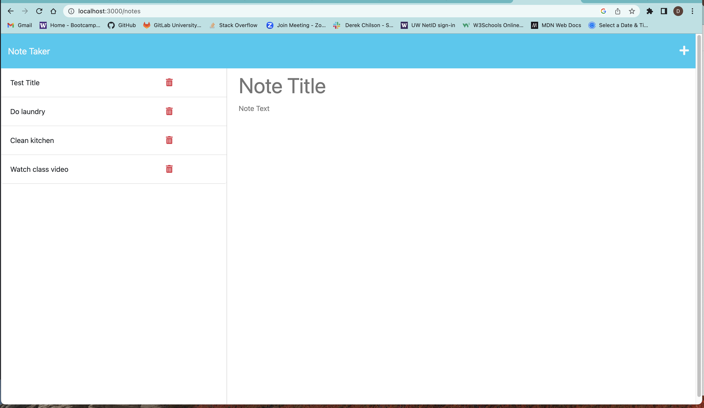
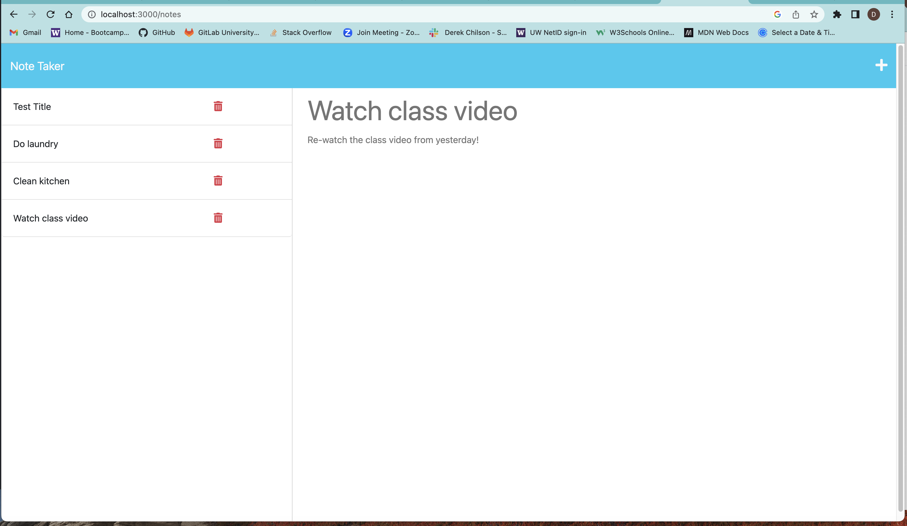

# my-note-taker

## Description
This app allows you as a small business owner to make a new todo by adding a new Title, then adding a todo note to look back at later. As your life gets busy sometimes it's nice to have a app to keep track for you. It will allow you to to look at the tasks that are needed to be completed for the day.

## Usage
 Here are some screenshots showing what the app looks like when there are notes and seeing the note to be completed.

 here is the link to github: https://github.com/Derekchili/my-note-taker.git

 here is the link to Heroku:  https://dsc-note-taker.herokuapp.com/notes

## Credits
Tutor Andres helped me finish the last thing I needed for the project to work proper.
